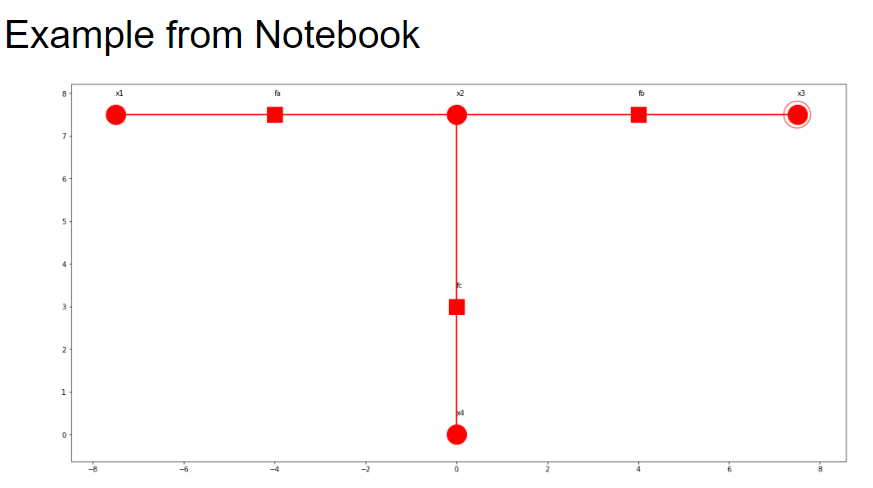
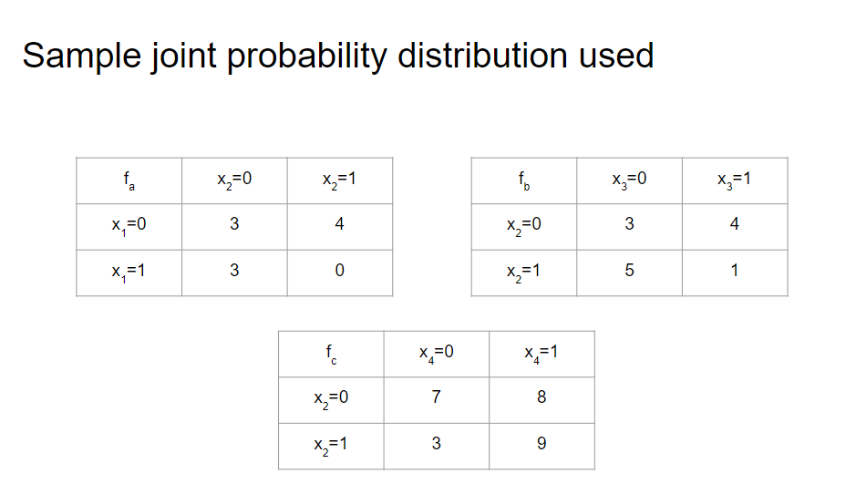
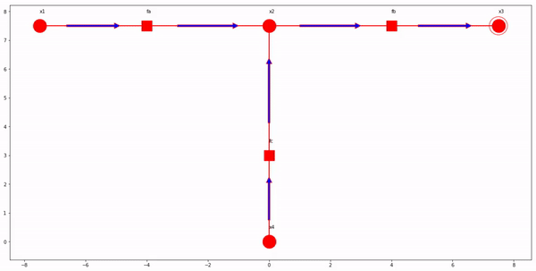

# PGM
PGM

Trying to grasp intuition behind inference on Probabilistic Graphical Model is difficult. This project is an 
attempt to make the visualization of three different algorithms sum-product, max-product, and max-sum algorithm and 
also shows an application of Markov Random Field to perform image de-noising, which is an important task in image pre-processing.
Example Graph, with their joint distribution:

Here is animation showing intermediate of the following algorithms: 
1. Sum-product:

2. Max-product:

3. Max-sum:

Please refer to [FinalNB](FinalNB.ipynb) for the complete code.

Here's a [link](https://drive.google.com/open?id=1vyAYN9v2A-Ll-6veON9y08_-uxxMTx4mNtuNXiejnSA) to Presentation created out of this project.
